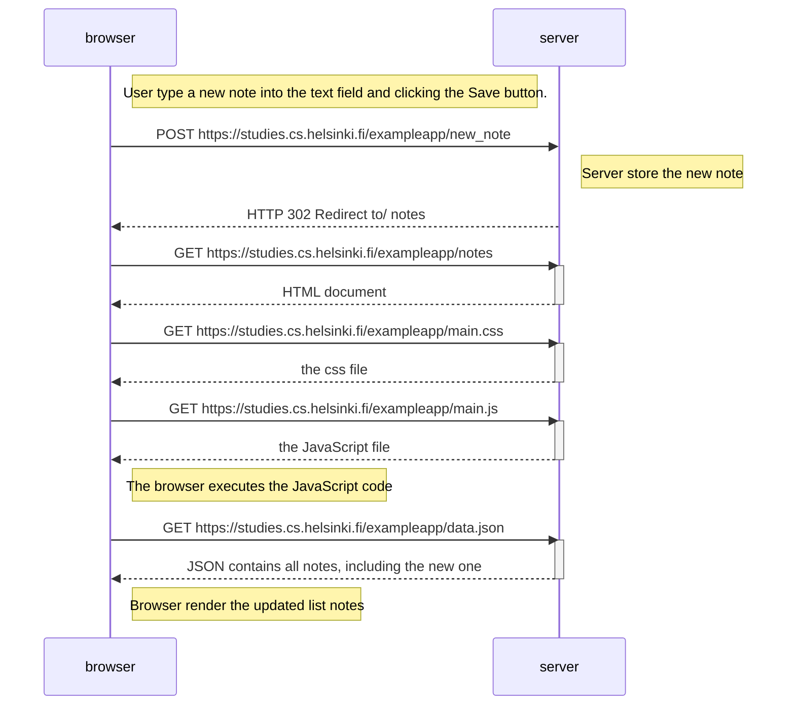

```mermaid
sequenceDiagram
    participant browser
    participant server

    Note right of browser: User type a new note into the text field and clicking the Save button.
    browser->>server: POST https://studies.cs.helsinki.fi/exampleapp/new_note
    Note right of server: Server store the new note

    server-->>browser: HTTP 302 Redirect to/ notes
    browser->>server: GET https://studies.cs.helsinki.fi/exampleapp/notes
    activate server
    server-->>browser: HTML document
    deactivate server

    browser->>server: GET https://studies.cs.helsinki.fi/exampleapp/main.css
    activate server
    server-->>browser: the css file
    deactivate server

    browser->>server: GET https://studies.cs.helsinki.fi/exampleapp/main.js
    activate server
    server-->>browser: the JavaScript file
    deactivate server

    Note right of browser: The browser executes the JavaScript code

    browser->>server: GET https://studies.cs.helsinki.fi/exampleapp/data.json
    activate server
    server-->>browser: JSON contains all notes, including the new one
    deactivate server
    Note right of browser: Browser render the updated list notes
```
