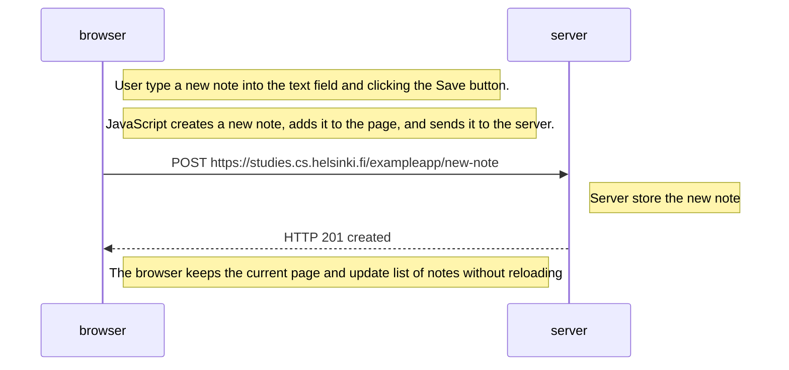

```mermaid
sequenceDiagram
    participant browser
    participant server

    Note right of browser: User type a new note into the text field and clicking the Save button.
    Note right of browser: JavaScript creates a new note, adds it to the page, and sends it to the server.
    browser->>server: POST https://studies.cs.helsinki.fi/exampleapp/new-note
    Note right of server: Server store the new note

    server-->>browser: HTTP 201 created
    Note right of browser: The browser keeps the current page and update list of notes without reloading
```